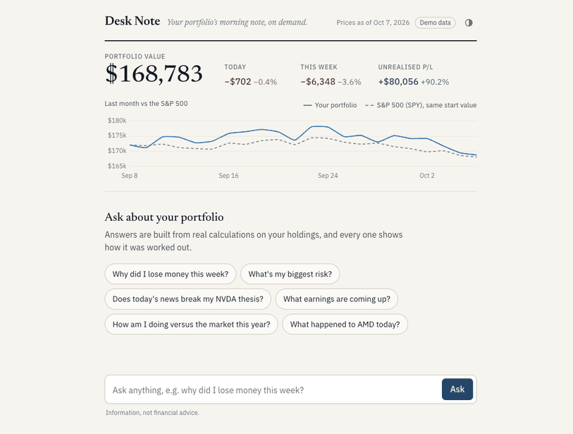

# Desk Note

**Your portfolio's morning note, on demand.** Ask questions about your portfolio in plain English. An AI analyst answers with real calculations on your actual holdings and shows which tools it used to get there.


<sub>Screenshot and demo use mock mode (synthetic prices and news). The figures come from the real tool outputs; the answer text was scripted for the capture.</sub>



## What you can ask

| Question | What happens behind the scenes |
|---|---|
| *Why did I lose money this week?* | `get_attribution(1w)` splits the change into market, sector and stock picks, then `get_news` checks the biggest stock-specific movers |
| *What's my biggest risk?* | `get_risk_report` returns concentration, correlated groups, volatility and a stress test |
| *Does today's news break my NVDA thesis?* | `get_thesis(NVDA)` pulls your thesis, what would break it, the stock-specific move, and news for NVDA **and** its watch list (Microsoft, Meta, Alphabet…) |
| *What earnings are coming up?* | `get_upcoming_events` lists dates with the options-implied move in % and in $ on your position |
| *How am I doing versus the market this year?* | `get_performance(ytd)` and a `portfolio_vs_market` chart |

In mock mode, the attribution tool's own headline for the first question reads:

> Of your -$6,348 over the last 5 trading days, -$4,136 was the market, -$753 was sector moves (Technology -$1,198; Energy +$324), and -$1,459 was your stock picks (stock-specific moves).

The risk report finds that 42% of the money sits in four semiconductor stocks (TSM, NVDA, AVGO, AMD) with an average pairwise correlation of 0.73.

## Quick start

```bash
python3 -m venv .venv && source .venv/bin/activate
pip install -r requirements.txt
cp .env.example .env          # then add your ANTHROPIC_API_KEY
python run.py --mock          # http://127.0.0.1:8000
```

`--mock` uses deterministic synthetic data. It needs no network for prices and works without an API key, but chat stays off until a key is set. Drop the flag to use live Yahoo Finance data. Options: `--port 8000`, `--host 127.0.0.1`.

You can also ask from the terminal:

```bash
python -m app.agent "why did I lose money this week?" --mock
python -m app.analytics --mock 1w      # print attribution + risk, no AI involved
```

Settings (in `.env`): `ANTHROPIC_API_KEY` (required for chat), `ANTHROPIC_MODEL` (default `claude-sonnet-5-5`), `ANTHROPIC_EFFORT` (default `medium`).

## Using your own portfolio

1. Edit **`portfolio.csv`** with one row per holding. `cost_basis` is your average cost **per share** and can be left blank. Duplicate rows are merged.
   ```csv
   symbol,shares,cost_basis
   NVDA,120,48.20
   ```
2. Edit **`theses.yaml`** with why you own each stock, what would prove you wrong, and related companies to watch. Watch-list news is what lets Desk Note spot read-across, such as a customer cutting spending.
   ```yaml
   NVDA:
     thesis: Hyperscaler data center capex keeps growing through 2027.
     breaks_if:
       - Big cloud customers cut or slow data center spending plans
     watch: [MSFT, META, GOOGL, AMZN, TSM]
   ```
3. Run `python run.py` without `--mock`.

## How it works

```
question ─▶ Claude (tool use) ─▶ tools.py ─▶ analytics.py ─▶ data.py (Yahoo / mock)
                 ▲                  │
                 └── JSON results ◀─┘        answer + trace + charts ─▶ UI
```

**The model never does the maths.** Every number in an answer comes from a Python function in `app/analytics.py`. Claude only decides which tools to call and explains what they return. The system prompt forbids stating any figure that didn't come from a tool result, including simple sums. LLMs are unreliable at arithmetic and will confidently recall stale prices. Keeping all computation in code makes every figure reproducible and testable.

**Every answer is traceable.** Each answer has a *How I got this* list showing every tool call, its inputs and a key result, for example "Split the last 5 trading days into market, sector and stock-picking". Charts come from the same data. The model only gets a short "chart shown to user" note, which saves tokens.

**Attribution method.** For each holding, a two-factor regression is fit on the year of daily returns before the period:

```
return = a + b_mkt × SPY + b_sec × (sector ETF − SPY)
```

The sector ETF is the SPDR fund for the stock's Yahoo sector (XLK, XLV, XLE…). For each day in the period, the return is split into market (`b_mkt × SPY`), sector (`b_sec × (ETF − SPY)`) and stock-specific (the residual, including the intercept). Each part is multiplied by the previous day's position value and summed. The parts add up exactly to the change in dollars. "Stock-specific" is the part of the move that neither the market nor the sector explains. That's the closest thing to measuring your stock picks rather than luck.

**Risk.** Built from one year of daily returns at current weights: annualised volatility, beta to SPY, each holding's share of risk (`wᵢ(Σw)ᵢ / wᵀΣw`), effective number of positions (`1/Σw²`), pairs correlated above 0.7, groups of holdings that move together, 1-year max drawdown, and a stress test (SPY −10% × each holding's beta).

**Agent loop.** Plain Anthropic SDK tool use: call `messages.create`, run every requested tool and return all the results in one message, then repeat. The loop is capped at 8 tool rounds, after which the model has to answer with what it has. Tool errors go back to the model as error results instead of crashing the request.

**Layout:** `app/data.py` (providers) · `app/portfolio.py` (CSV/YAML) · `app/analytics.py` (all maths) · `app/tools.py` (schemas + dispatch) · `app/agent.py` (loop) · `app/server.py` (FastAPI) · `app/static/index.html` (UI, no build step) · `tests/` (all offline).

```bash
python -m pytest -q
```

## Limitations

- **Yahoo Finance data quality.** yfinance is an unofficial API. Prices can lag, sectors can be missing (those holdings use a market-only model), news is thin and sometimes market-wide rather than company-specific, and options data may be missing (no implied move shown). Unknown tickers are skipped with a warning.
- **Current share counts.** All history, including attribution, performance and drawdown, assumes you held today's share counts for the whole period. Trades, deposits and dividends paid out aren't modelled.
- **Simple models.** Two-factor betas are estimates. A semiconductor-wide move shows up as "stock-specific" because the model has no industry factor. Implied moves use an ATM straddle approximation.
- **Not investment advice.** Desk Note lays out facts and considerations. It doesn't recommend trades.

## Next steps

- Broker CSV import (Schwab, Fidelity, IBKR) with real transaction history
- ETF look-through, so VOO counts as its underlying sectors
- Morning email or Telegram brief
- Thesis alerts: notify when watch-list news challenges a thesis
