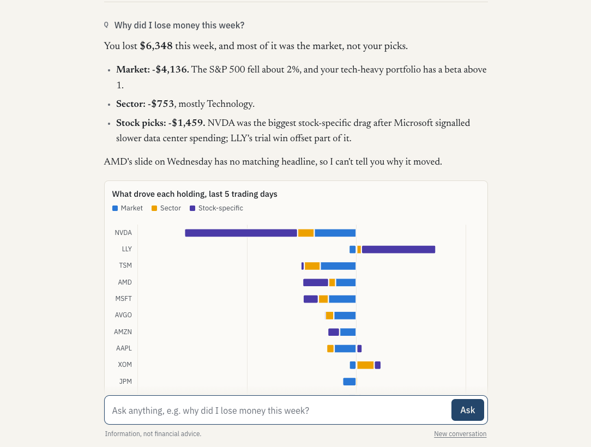

# Desk Note

[](https://github.com/nching-tael/desk-note/actions/workflows/tests.yml)

A personal analyst for a stock portfolio. You ask questions in plain English ("why did I lose money this week?", "what's my biggest risk?", "does today's news break my NVDA thesis?") and get answers built from real calculations on your actual holdings.

The language model never does the maths. Claude decides which tools to call and explains the results; every number comes from Python.

There are two ways to use it:

- As an MCP server that plugs into Claude (desktop, mobile or Claude Code). I run it on a Raspberry Pi so it's always available from my phone. Claude does the web research, Desk Note supplies the numbers, records trades and keeps a decision journal.
- As a standalone web app with its own Claude agent loop, charts, and a list of the tool calls behind every answer.



The screenshot uses mock mode (synthetic prices and news). The figures are real tool output; the answer text was written for the capture.

## What it can tell you

**Why the portfolio moved.** Each holding's change is split into what the market did, what its sector did, and what's specific to the stock, in dollars:

> Of your -$6,348 over the last 5 trading days, -$4,136 was the market, -$753 was sector moves (Technology -$1,198; Energy +$324), and -$1,459 was your picks.

**What your ETFs really hold.** Funds are opened up into the stocks and sectors underneath, so a portfolio of VOO, QQQ and SMH shows up as, say, 8.7% Nvidia spread across three funds and 51% technology overall. Sector funds like SMH or XLE are measured against their sector; broad funds like VOO against the market.

**Whether you're still on target.** Save a target allocation (say 70% core, four satellites at 7.5%) and Desk Note shows how far each position has drifted, the trades that would rebalance it, and how to invest new money so you move back toward target without selling.

**Whether your bets are worth it.** The satellite scorecard compares each satellite with what the same money would have made in your core over the same days: "SMH made $594; the same dollars in VOO would have made $153, so the bet added $441."

**Hidden concentration.** Holdings that move together are grouped, so eleven stocks can turn out to be "42% of your money in four chip stocks with an average correlation of 0.73". Each holding's share of overall risk is shown next to its weight.

**Whether a thesis still holds.** You write down why you own something, what would prove you wrong, and which related companies to watch. Thesis checks pull news for the stock and its watch list, so a customer cutting spending shows up even when the headline never mentions your stock.

**How your decisions worked out.** When you record a trade you can say why. Reviewing the journal later compares each decision with what the stock did afterwards, adjusted for the market.

**Risk in dollars.** What a bad day or week has cost this mix of holdings (1 in 20, 1 in 100), the worst day, week and month, drawdowns and how long they took to recover, how holdings behave when the market falls (downside beta), market drops of 10, 20 and 35%, and replays of 2008, 2018, 2020 and 2022 on today's holdings. Plus the options-implied move into upcoming earnings.

## Running it

```bash
python3 -m venv .venv && source .venv/bin/activate
pip install -r requirements.txt
```

Web app (mock data, no network needed for prices):

```bash
cp .env.example .env        # add ANTHROPIC_API_KEY to enable chat
python run.py --mock        # http://127.0.0.1:8000
```

MCP server:

```bash
python -m app.mcp_server --mock                 # stdio, for Claude Desktop / Claude Code
python -m app.mcp_server --http --port 8001     # remote, needs DESK_NOTE_MCP_TOKEN
```

Setting it up on a Raspberry Pi and connecting the Claude app is covered in [docs/raspberry-pi.md](docs/raspberry-pi.md).

Some other entry points:

```bash
python -m app.analytics --mock 1w                  # attribution and risk report, no AI
python -m app.agent "what's my biggest risk?" --mock
python -m app.store show                           # what's in the database
```

Drop `--mock` everywhere to use live Yahoo Finance data.

## Using your own portfolio

Put your positions in `portfolio.csv` (`symbol,shares,cost_basis`, where cost basis is the average cost per share) and your reasons for owning them in `theses.yaml`:

```yaml
NVDA:
  thesis: Hyperscaler data center capex keeps growing through 2027.
  breaks_if: [Big cloud customers cut or slow data center spending plans]
  watch: [MSFT, META, GOOGL, AMZN, TSM]
```

The first run copies both into a SQLite database (`data/desknote.db`). After that, tell Claude about trades and thesis changes and they're recorded there.

## How it works

```
Claude app ── MCP ──┐
                    ├── tools.py ── analytics/ ── data/ (Yahoo Finance or mock)
Web UI ── agent.py ─┘                   └── store.py (SQLite)
```

- `app/data/`: market data providers. `yahoo.py` wraps yfinance with a disk cache and falls back through three news sources; `mock.py` generates a deterministic market with a scripted week.
- `app/analytics/`: all the calculations. `core.py` loads prices and works out daily gains, returns and attribution; `exposure.py` classifies funds and looks through them; `tail.py` and `stress.py` do the history-based risk and crash replays; `allocation.py` and `scorecard.py` handle targets and satellites; `risk.py`, `research.py`, `journal.py` and `charts.py` cover the rest.
- `app/tools.py`: the 19 tools Claude can call, each defined next to its handler.
- `app/grounding.py`: checks that every number in an answer appears in a tool result.
- `app/store.py`: trades, theses and the journal in SQLite.
- `app/mcp_server.py`, `app/agent.py`, `app/server.py`: the MCP server, the web app's agent loop and its FastAPI server.

Attribution fits `return = a + b_mkt × SPY + b_sec × (sector ETF − SPY)` for each holding on the year before the period, then splits every day's return into those parts and weights them by the previous day's position value. Gains only count shares held overnight, so buying more isn't mistaken for profit, and returns are time-weighted.

The formulas, a worked example you can check by hand, and how each calculation is tested are in [docs/methodology.md](docs/methodology.md).

```bash
python -m pytest -q    # 154 tests, all offline
ruff check .
```

### Checking the model doesn't do maths

The rule is enforced in two ways. Every web-app answer goes through `app/grounding.py`, which pulls out each number and looks for it in the tool results (rounding like "about $14k" is allowed; adding two tool figures together isn't). Untraceable numbers are shown under the answer. And `python -m evals.run` asks the real model 20 standard questions and scores each answer on four things: it answered, it called the right tool, every number traces to a tool, and it didn't tell you to buy or sell. That run uses the API, so it costs a little each time.

## Limitations

- Yahoo Finance via yfinance is unofficial. Prices lag, sectors and options data are sometimes missing, and the news feed is thin, which is why the MCP setup leans on Claude's own web search.
- Trades take effect at the close of their date. Dividends count as reinvested and cash isn't tracked.
- Cost basis is average cost, so realised gains won't match broker tax forms (usually FIFO).
- Look-through uses each fund's published top holdings (usually ten), so the rest of a fund isn't broken down by stock; sector exposure uses the full sector weights. Foreign listings and share classes (2330.TW vs TSM, GOOG vs GOOGL) count separately.
- Betas are estimates. There's no industry factor, so a move across the whole chip sector counts as stock-specific for each chip stock, and a sector ETF includes the stock itself.
- The remote MCP endpoint is protected by a secret token in its URL. Fine for one person; it would need OAuth before sharing.
- It's information, not investment advice, and it never connects to a brokerage.

## Ideas

- OAuth for the remote connector
- Import trade history from broker CSV exports
- Look through ETFs to their underlying holdings
- Store SEC filings and insider trades as a searchable source
- Alerts when watch-list news challenges a thesis

## License

MIT
